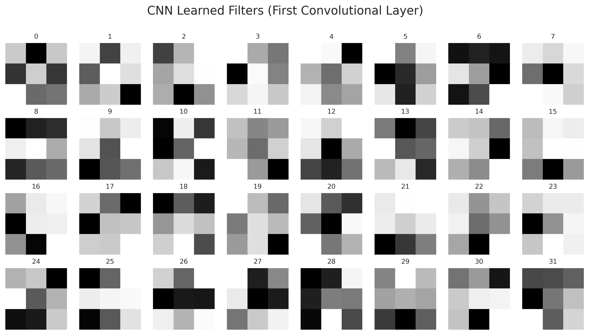
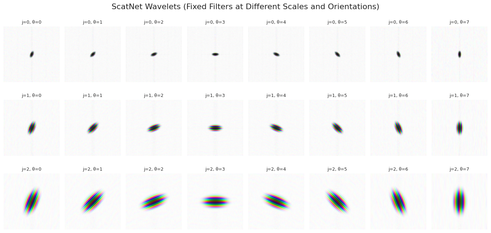
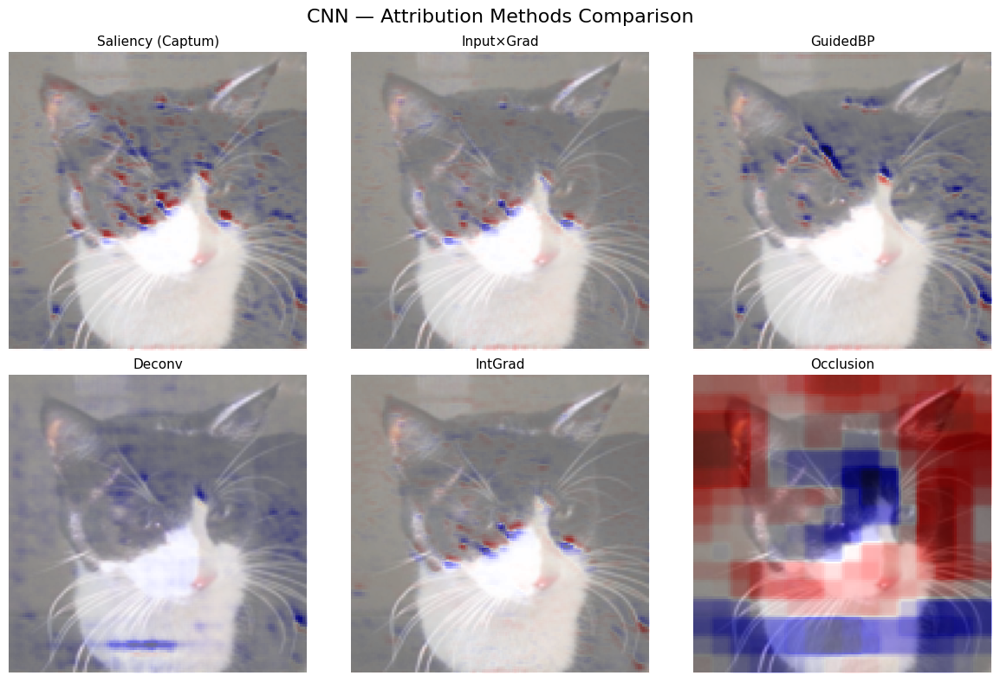
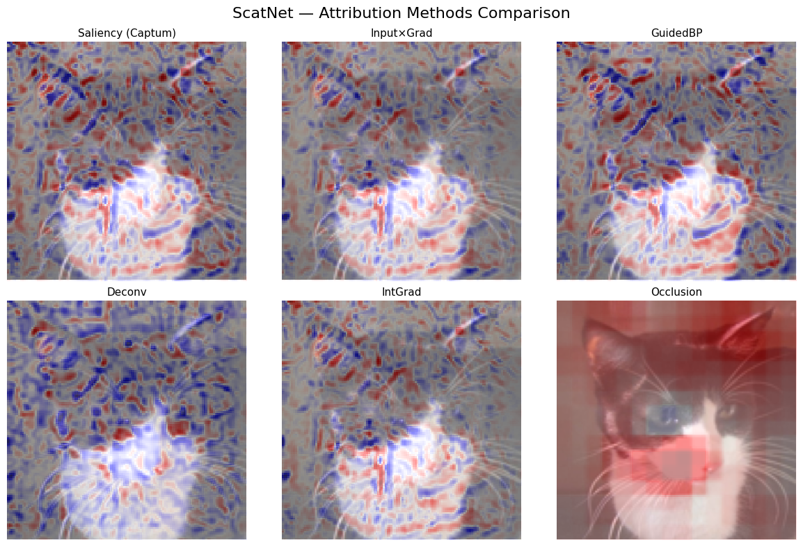

# CNN vs ScatNet - Binary Image Classification

> **Visual Intelligence** course project - University of Verona (2025–2026)  
> Author: **Ewad JAMIN**

A comparison of two approaches to image feature extraction for binary classification (**Cats vs Dogs**): a standard CNN with learned filters and a ScatNet using fixed wavelet filters. The project evaluates both models on predictive performance, filter analysis, and interpretability through six XAI attribution methods.

## Dataset

[Cats vs Dogs - Kaggle](https://www.kaggle.com/datasets/alifrahman/dataset-for-wbc-classification)

- **2802 RGB images**, balanced: 1401 cats, 1401 dogs
- **Split:** 1000 images/class for training, 401 images/class for testing
- All images resized to **128×128 pixels**, pixel values normalized to **[0, 1]**

**Data augmentation** is applied to the training set only, to improve generalization and encourage the CNN to learn meaningful filters:
- Random horizontal flip
- Random rotation (±15°)
- Color jitter (brightness, contrast, saturation)
- Random grayscale conversion

No augmentation is applied to validation and test sets.

---

## Models

### Convolutional Neural Network (CNN)

A compact 3-block CNN designed for 128×128 RGB input images.

**Architecture:**

| Block | Operation | Output shape |
|-------|-----------|--------------|
| Conv Block 1 | Conv2d(3→32, 3×3, pad=1) + ReLU + MaxPool(2×2) | 32 × 64 × 64 |
| Conv Block 2 | Conv2d(32→64, 3×3, pad=1) + ReLU + MaxPool(2×2) | 64 × 32 × 32 |
| Conv Block 3 | Conv2d(64→128, 3×3, pad=1) + ReLU + MaxPool(2×2) | 128 × 16 × 16 |
| Classifier | Flatten → FC(32768→256) + ReLU + Dropout(0.5) → FC(256→2) | 2 logits |

**Design choices:**
- The three successive MaxPool(2×2) layers reduce spatial resolution from 128×128 down to 16×16, progressively compressing spatial information while increasing representational depth.
- Channel count grows from 32 → 64 → 128, following the standard practice of increasing feature map depth as spatial resolution decreases. This lets the network capture increasingly abstract patterns: from low-level edges in block 1 to higher-level textures and shapes in block 3.
- All convolutions use padding=1 to preserve spatial dimensions before pooling.
- Dropout(0.5) before the final linear layer acts as a regularizer to reduce overfitting on the training set.

**Learned filters (first convolutional layer):**



The first-layer filters spontaneously develop oriented edge detectors, color-sensitive patterns, and localized texture extractors: consistent with what is observed in the literature for CNNs trained on natural images. Some filters specialize in detecting horizontal structures, others in dark corners or bright regions, which are useful cues for distinguishing animal contours, fur textures, and facial features.

---

### Scattering Network (ScatNet)

Built using the [Kymatio](https://www.kymat.io/) library. Unlike the CNN, **ScatNet uses no learned convolutional weights** - its filters are mathematically predefined Morlet wavelets.

**Configuration:**
- `J = 3` scales - controls the range of frequencies captured
- `L = 8` orientations - wavelet filters covering 8 directions
- Scattering order `M = 2` - applies up to two successive wavelet convolutions + modulus operations

**How it works:**  
The scattering transform applies cascaded wavelet convolutions, each followed by a modulus non-linearity (which introduces stability to phase shifts) and a local averaging operation. The result is a set of **scattering coefficients** that are provably stable to small translations and deformations, properties that pure gradient descent does not guarantee for CNNs.

The scattering coefficients are flattened and passed to the **same classifier head as the CNN** (FC 256 → ReLU → Dropout → FC 2). This design choice ensures that any performance difference between the two models is attributable to the feature extraction stage, not the classifier.

**Fixed wavelet filters (ScatNet):**



In contrast to learned CNN filters, ScatNet filters exhibit clear multi-scale directional patterns determined by their mathematical definition, not the data. They do not adapt to the dataset distribution but are theoretically designed to maximize signal stability.

---

## Experimental Setup

- **Optimizer:** Adam, learning rate = 1e-3, batch size = 32
- **Loss:** Cross-Entropy
- **Epochs:** 30 for CNN - 10 for ScatNet (its fixed features require far less adaptation)
- **Validation strategy:** 5-fold cross-validation with a fixed random seed for reproducibility

For each fold, training data is split into train/validation subsets. Data augmentation is applied only to the train subset. At each epoch, validation accuracy and weighted F1-score are tracked. The checkpoint with the highest validation accuracy is saved for each fold.

After cross-validation, the best model across all folds is selected and evaluated on the held-out test set.

---

## Classifier

Both models share an identical classifier head: the only structural difference being the input dimension, which varies with the feature extractor. This design ensures that performance differences are attributable solely to the feature extraction stage: learned convolutions vs fixed wavelet coefficients.

## Results

### Cross-Validation Performance

ScatNet achieves slightly higher mean accuracy across the 5 folds, with **lower standard deviation**, indicating more stable training. This is expected: since ScatNet filters are fixed, the feature space does not change between runs, and the classifier converges consistently. The CNN, by contrast, learns its filters from scratch at each fold, making it more sensitive to initialization and more prone to landing in different local minima.

### Test Set Performance

| Model   | Accuracy | F1-score |
|---------|----------|----------|
| CNN     | 75.81%   | 0.7575   |
| ScatNet | 77.93%   | 0.7785   |

ScatNet outperforms the CNN by ~2% on the test set. Given the relatively small dataset (2000 training images), this suggests that the predefined wavelet representation provides a more robust inductive bias than a CNN trained from scratch, particularly when data is limited.

Both models show balanced precision and recall across both classes (difference < 3%), with no significant class bias.

**Learning curves (averaged over folds):**


The CNN shows a progressive loss reduction with a mild generalization gap appearing after ~20 epochs, suggesting light overfitting despite dropout. ScatNet converges within a few epochs and stabilizes, the classifier has very little to adapt since the features are already structured and stable.

### Filter Comparison

The key representational difference is visible when comparing filters directly:
- **CNN filters** are optimized for the specific training data and develop task-relevant patterns (edge detectors, color blobs, texture extractors).
- **ScatNet filters** are fixed multi-scale wavelets, mathematically designed for stability - independent of the data distribution.

This reflects the core trade-off explored in this project: **data-driven flexibility** vs **theoretically grounded stability**.

---

## Explainable AI

Six attribution methods were applied to both models using [Captum](https://captum.ai/) to understand where each model focuses when making predictions:

| Method | Type | Description |
|--------|------|-------------|
| Saliency | Gradient | Gradient of the output w.r.t. input pixels |
| Input × Gradient | Gradient | Element-wise product of input and gradient |
| Guided Backpropagation | Gradient | Backprop with ReLU gates applied to gradients |
| Deconvolution | Gradient | Similar to GuidedBP but without input gating |
| Integrated Gradients | Gradient | Averages gradients along a path from baseline to input |
| Occlusion | Perturbation | Measures output change when patches are masked |

The **Saliency** method was also implemented from scratch using PyTorch autograd and compared against Captum's output to validate correctness. The two implementations produce virtually identical attribution maps (mean absolute difference < 1e-6).

**Attribution maps - CNN:**



**Attribution maps - ScatNet:**



**Key findings:**

- **CNN** produces sharp, spatially localized attribution maps. Gradient-based methods (especially Saliency) concentrate on discriminative facial features: eyes, ear contours, nose region. This is interpretable and aligned with what a human would focus on.
- **ScatNet** produces denser, more spatially distributed maps. Because scattering coefficients encode global multi-scale structure, the model does not focus on narrow local regions - attributions spread across the image. This makes gradient-based explanations harder to interpret visually. Occlusion, which works at a patch level, provides relatively clearer region-level insights for ScatNet.
- Across both models, **Integrated Gradients** and **Input × Gradient** produce consistent, smooth maps. **Deconvolution** is the least stable. **Occlusion** is coarser but more semantically grounded, as it directly measures the impact of removing image regions.

---

## Project Structure

```
cnn-vs-scatnet/
├── notebook/
│   └── notebook.ipynb   # Training, evaluation, filter viz, XAI
├── models/
│   ├── cnn_best.pth                   # Best CNN checkpoint (~34 MB)
│   └── scatnet_best.pth               # Best ScatNet checkpoint (~173 MB, see note)
├── assets/
│   ├── learning_curves.png
│   ├── cnn_filters.png
│   ├── scatnet_filters.png
│   ├── attribution_cnn.png
│   └── attribution_scatnet.png
├── requirements.txt
├── README.md
└── .gitignore
```

> **Note on `scatnet_best.pth`:** At 173 MB, this file may not be included in the repository. To regenerate it, run the training section of the notebook : ScatNet converges in ~10 epochs and takes only a few minutes on GPU.

---

## Running the Notebook

The notebook was developed on **Google Colab** with GPU acceleration. The dataset is loaded from Google Drive. This is the recommended setup.

### On Google Colab (recommended)

1. Open the notebook in Colab
2. In one of the first cell, you will mount your Google Drive:
   ```python
   from google.colab import drive
   drive.mount('/content/drive')
   ```
3. Download the dataset from [Kaggle](https://www.kaggle.com/datasets/alifrahman/dataset-for-wbc-classification), upload it to your Drive, and update the dataset path variable in the configuration cell
4. Select a GPU runtime: **Runtime → Change runtime type → T4 GPU**

### Running locally

```bash
pip install -r requirements.txt
jupyter notebook notebook/Project_VI_Ewad_JAMIN.ipynb
```

Then remove or comment out the `google.colab` import cell and update the dataset path to point to your local directory.

### Training part

The training part is commented, in order to proceed faster with the uploaded models. 
If needed, remove the comment part to test the training part. You can also save your model by removing some comment part.